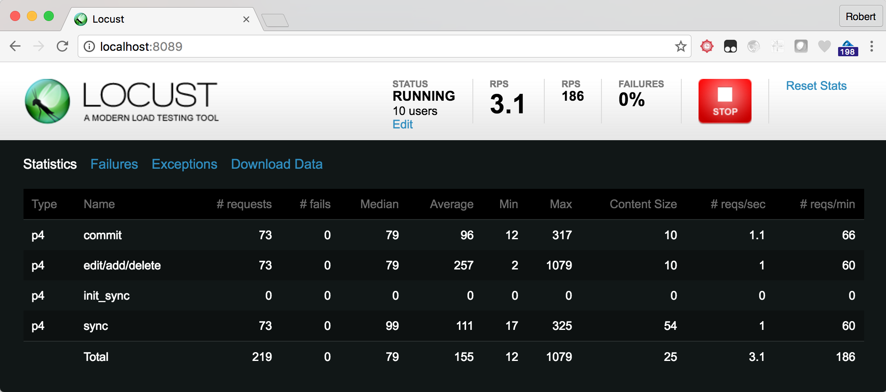

# Benchmarking tool for Perforce

Based on [Locust](https://locust.io):

Locust is an easy-to-use, distributed, user load testing tool. Intended for load testing web sites (or other systems) and figuring out how many concurrent users a system can handle.

* Write user test scenarios in plain-old Python
* Distributed & Scalable - supports hundreds of thousands of users
* Web-based UI
* Can test any system

For more info:

* Docs: http://docs.locust.io/en/latest/what-is-locust.html
* Github source: https://github.com/locustio/locust

# Background

A customised version of Locust which supports Perforce (and some legacy support for SVN) benchmarking with a configurable
number of users executing basic tasks (e.g. sync/edit/add/delete/submit).

It performs random numbers of adds/edits/deletes with files which are randomly text or binary
(according to some currently hard coded relative distributions).

Basic measure in the output is time for parallel syncs of data, and the number of submits/commits per second/minute. Easily extended for more involved benchmarking tasks.

Uses Ansible for working with multiple client machines. Recommend you consider using the mitogen plugin for improved
speed.

## Benchmark Goals

First you need to decide what you are benchmarking - which configurations of commit/edge/other replicas
and also different types of storage. The basic idea is to run similar tests against different configurations
and compare the results. If the configurations differ too much it is hard to draw conclusions.

Installation of Perforce Helix server is typically a manual operation, although we recommend using the
[SDP (Server Deployment Package)](https://swarm.workshop.perforce.com/projects/perforce-software-sdp). This allows for 
example two or more instances to be setup, e.g. instance 1 with a particular configuration
and instance 2 with the other configuration you want to test.

See the Docker Compose and Dockerfiles for an example of how the SDP is setup.

There is also a set of Terraform files which can be used to automate the whole process in AWS (Azure to come!)

# Simple Setup - Docker Compose

There is a Dockerfile and related docker-compose.yml which show how to
install a benchmark driver server, a single (commit) server, and run the benchmark with 2 client machines.

It is based onRocky Linux 8 container and does full installation and runs the tests.

    docker-compose build

Whick will take 5-10 mins to build the containers (there is a basic one and one for the master server). NOTE - requires docker-compose 3.4+ features!

    docker-compose up

This will produce quite a lot of output but should end up with something like:

```
:
master_1   | Report for instance: 1
master_1   | lrwxrwxrwx 1 root root 20 Apr 16 09:53 /p4/1/root -> /hxmetadata/p4/1/db1
master_1   | run/1
master_1   | 
master_1   |     workspace_root:  /home/p4/ws
master_1   | 
master_1   | Workspace sizes on commit (for cross check)
master_1   | Client: Files Size
master_1   | 921 380.90G
master_1   | Submitted change start 40 end 186
master_1   | Count: 97
master_1   | 
master_1   | 
master_1   | Waiting for 600 seconds (in case you want to have a look at the machine)
master_1   | If so, run this from another terminal session:
master_1   |     docker exec -ti p4benchmark_master_1 /bin/bash
```

When done, just Ctrl+C to stop the containers. (Or use `docker ps` and `docker kill`).

Note that the main script to look at is: docker_entry_master.sh

# Details for manual configuration

## Pre-requisites

You need to ensure that all client machines have the basic software installed:

- a suitable test account, e.g. perforce, with sudo access on the boxes (may require known_hosts to be setup)
- ssh access without passwords (also required for Ansible)
- suitable Python installation (e.g. Python 3.8) and other dependencies of Locust (see docker/Dockerfile)

## Configuration of server and client machines

The Ansible scripts are primarily in the `./ansible` directory. They can be run manually but are typically
run by the top level bash scripts.

Edit the Ansible hosts file to reflect the names of your actual machines. 

See the example `hosts.docker.yaml`. It is a YAML format for Ansible, and includes various configuration values
for the actual locust scripts.

You may have several versions of this file, and set an environment variable `ANSIBLE_HOSTS` to point to the desired one.

## Bootstrapping machines

It is possible to setup all machines using a bootstrap script, assuming that you have
at least one account on the machines with ssh access enabled, even if it is via password.

The aim of the bootstrap script is to make ssh possible via key rather than password, enable sudo access for perforce account etc.

If run with say root access, requiring a password, you can do:

    sudo ansible-playbook -i hosts ansible/bootstrap.yml -k -K --extra-vars "hosts=replicas user=root"

This will prompt for password and then do the actions in the script.

# Setting up your Perforce commit instance(s)

It is recommended to use the SDP to configure and start your instance, assigning appropriate storage etc.

The benchmark scripts rely on an SDP structure being in place.

## Creating repository files

There is a script locust_files/createfiles.py which can be run to create large amounts of random content for binary and text files. 

Typically you would use it to store content in a repository structure containing multiple buckets (e.g. 00 - 39) such as:

    //depot/00/00/<random file name>.txt
    //depot/00/00/<random file name>.dat
    :
    //depot/39/39/<random file name>.dat

The number of "buckets" and the sizes of the files is part of your benchmark planning:

* What is the total size of the depot files you want to create? E.g. 500GB, or 1TB (typically if testing storage you want to exceed the size of RAM in your server to reduce the effects of file system caching)
* The size of each client workspace to be synced to client machines (often it is easier to go with 1-10GB per bucket to avoid hitting network bandwidth limits)

This is a manual step as you need to:

* decide on repository structure/size etc
* decide on distribution of text vs binary files
* create a workspace
* create the files within the workspace (using script)
* submit those files to the server (manually)

RECOMMENDATION: Please use a different p4 user account to submit the files for your base setup. This makes it easy
to reset your p4d repository by obliterating all changelists belonging to user `bruno` after a benchmark run.

Note that it can take hours to perform these steps (the submitting of a large number of files - though typically only done once).

```
    usage: createfiles.py [-h] [-m MAX] [-l LEVELS [LEVELS ...]] [-s SIZE]
                        [-d ROOTDIR] [-c] [-t] [-b]

    optional arguments:
    -h, --help            show this help message and exit
    -m MAX, --max MAX     Number of files to create (default 100)
    -l LEVELS [LEVELS ...], --levels LEVELS [LEVELS ...]
                            Directories to create at each level, e.g. -l 5 10
    -s SIZE, --size SIZE  Average size of files (default 20000)
    -d ROOTDIR, --rootdir ROOTDIR
                            Directory where to start
    -c, --create          Create the files as specified instead of just printing
                            names
    -t, --textonly        Only create text files
    -b, --binaryonly      Only create binary files
```

You can run the script multiple times to generate just binary files, or just text files, or to add more data. It doesn't matter if the randomly generated names are duplicates.

E.g.

    python3 createfiles.py -l 40 40 -s 100000 -m 20000 -d /tmp/ws --create

Will create the files in `/tmp/ws`. You should then make sure the `Root:` of your client workspace points at this directory, and that the
`View:` mapping is appropriate.

It is easy to spawn multiple jobs in parallel to the same directory to create files faster.

Note that the docker script automates this to some extent:

```
# Set P4 env
export P4CLIENT=test_ws
export P4USER=perforce

# Create a test workspace root dir
ws_root=/p4/test_ws
mkdir $ws_root
cd $ws_root

# Create a client workspace with correct view - will default Root: to current directory
p4 --field "View=//depot/... //test_ws/..." client -o | p4 client -i

# Create the random test files.
python3 /p4/benchmark/locust_files/createfiles.py -d $ws_root -l 5 5 -c

# Reconcile (to add) and submit them
p4 rec 
p4 submit -d "Initial files"

# List changes to confirm success
p4 changes -t
```

### Submitting the files

Recommended is to submit each bucket in parallel.

Typically we would submit the files as user "perforce" so that when benchmark makes changes as user "bruno" they can be easily distinguished and obliterated if required.

Setup your P4PORT/P4CLIENT/P4USER environment variables, and install [Gnu Parallel]()

  for i in {00..39}; do echo $i >> list.txt ; done
  nohup cat list.txt | parallel 'echo -n {}" "; ./do_rec.sh {} >> {}.out 2>&1 ' &

Where `do_rec.sh` is:

``` bash
#!/bin/bash
# Reconcile a tree created by createfiles.py
# Parameter: <2 digit directory>
root=`pwd`
dir="$root/$1"
p4 rec -a $dir/...
p4 submit -d "Initial import" "$dir/..."
```

# Running the benchmark(s)

There are currently 2 benchmarks:

* syncbench - only syncs workspaces
* basic - syncs as well as performs edits/adds/deletes and reporting actions

## Configuration

Edit the file `hosts.yaml` and according the comments in it to specify your local P4D and
repository paths to use.

``` yaml
all:
  vars:
    # Other vars
    # :

    # Script vars:
    general:
        min_wait: 1000
        max_wait: 10000
        workspace_root: /tmp/bench_tests
    
    # Perforce benchmark testing parameters
    # Specify password if required
    # port is an array to allow for multiple possible servers to be specified if required
    perforce:
        port:       
        - 10.21.152.35:1666
        - 10.21.152.36:1666
        user:       bruno
        charset:
        password:
        options:  noallwrite noclobber nocompress unlocked nomodtime rmdir
        # The following only takes effect if sync_args not used.
        sync_progress_size_interval: 100 * 1000 * 1000
        # The following should not include trailing /...
        # Will be used as base for selection after running "p4 dirs %s/*"
        repoPath:   //depot
        repoSubDir: "*"
        # Following selects a number of sub directories - so you can set to say 50% of the directories at the next level
        repoSubDirNum: 80
        # How many times to repeat the task before exiting
        repeat: 50
        # sync_args: any extra sync arguments. This will result in the spawning of a "p4" command
        # Example to avoid actually writing files to filesystem on client side:
        #sync_args: -vfilesys.client.nullsync=1
        #sync_args: -vtrack=1
        # Any other -v or similar options possible.
        # Note that the following commands will be passed automatically: -p/-u/-c
```

## Running the tool

Ensure Perforce server running:

    utils/run_bench.sh 1 basic

This will typically take a minute or two to launch the benchmark.

You can observe via `utils/do_monitor.sh` how many concurrent processes are running against the server(s).

When the benchmark has finished:

    utils/analyse.sh

This creates a new directory under `./run/` and copies relevant log files from the worker (client) machines, as well as the replicas (if used). 
At the end it will run the `log2sql` log analysis script to create a Sqlite database, and then run some queries on that database.

It uses `log2sql` from https://github.com/rcowham/go-libp4dlog/releases (see Dockerfile for example of installation)

It also saves various configuration values, so that you can compare
and contrast the results of different configurations with
each other.

There is a convenience script: `utils/wait_end_bench.sh` - you can edit this script and check to make sure it is configured with any replicas used.

Then the following command will run everything:

``` bash
nohup utils\run_bench.sh 1 basic && sleep 30 && utils/wait_end_bench.sh && sleep 30 && utils/analyse.sh &
```

## Examples of running the tool

Running in no-web mode:

    locust -f p4_locust.py --no-web
    locust -f svn_locust.py --no-web

Running in web mode (defaults to http://localhost:8089):

    locust -f p4_locust.py
    locust -f svn_locust.py

### Web output

Note the key measure is the "commit" line, as every commit contains add/edit/delete and is
preceded by a sync. Unfortunately the init_sync values are reset currently (web app background
of initial design) - needs tweak
to leave as useful to understand what happens first time you sync a workspace as opposed
to just syncing updates.



### Running with multiple client machines

As per locust documentation - easy to run a single master locust with multiple child instances
on different machines, each communicating results to the master for reporting.

* Locust distributed: http://docs.locust.io/en/latest/running-locust-distributed.html

### Pre-requisites

Tested on Windows (with 32 bit python) and Linux/Mac.

* Python 3.8+

The following packages should be installed via pip:

    pip3 install -r requirements.txt
